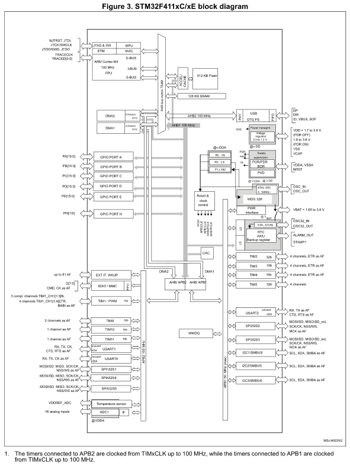

==================
STM32F411 Overview
==================

The STM32F411 microcontrollers are part of the STM32 Dynamic Efficiency™ lines. These devices represent the entry level to the High Performance F4 Series, offering a balanced combination of dynamic power consumption (in run mode) and processing performance. They integrate a rich set of features in compact 3 x 3 mm packages.

The STM32F411 MCUs are powered by a Cortex®-M4 core with floating point unit, operating at 100 MHz, and achieve exceptionally low power consumption in both run and stop modes. A key feature, Batch Acquisition Mode (BAM), optimizes power usage during data batching. This mode enables efficient data exchange through communication peripherals while keeping the CPU and other parts of the device in power-saving modes.

Features
--------

- Includes ST state-of-the-art patented technology
- Dynamic efficiency line with BAM (Batch acquisition mode)
- Operating voltage: 1.7 V to 3.6 V
- Temperature range: -40°C to 85/105/125 °C

**Core**

- Arm® 32-bit Cortex®-M4 CPU with FPU
- Adaptive real-time accelerator (ART Accelerator) for 0-wait state execution from flash memory
- Operating frequency up to 100 MHz
- Memory protection unit
- 125 DMIPS/1.25 DMIPS/MHz (Dhrystone 2.1)
- DSP instructions

**Memories**

- Up to 512 Kbytes of flash memory
- 128 Kbytes of SRAM

**Clock, Reset, and Supply Management**

- Wide range application supply and I/O voltage: 1.7 V to 3.6 V
- Power-on reset (POR), power-down reset (PDR), power voltage detector (PVD), and brown-out reset (BOR)
- 4-to-26 MHz crystal oscillator
- Internal 16 MHz factory-trimmed RC oscillator
- 32 kHz oscillator for RTC with calibration
- Internal 32 kHz RC oscillator with calibration

**Power Consumption**

- Run mode: 100 μA/MHz (peripheral off)
- Stop mode (Flash in Stop mode, fast wakeup time): 42 μA typical at 25 °C; 65 μA max at 25 °C
- Stop mode (Flash in Deep power down mode, slow wakeup time): down to 9 μA at 25 °C; 28 μA max at 25 °C
- Standby: 1.8 μA at 25 °C / 1.7 V without RTC; 11 μA at 85 °C at 1.7 V
- VBAT supply for RTC: 1 μA at 25 °C

**Analog Features**

- 1x12-bit, 2.4 MSPS A/D converter: up to 16 channels

**DMA**

- General-purpose DMA: 16-stream DMA controllers with FIFOs and burst support

**Timers**

- Up to 11 timers: up to six 16-bit, two 32-bit timers up to 100 MHz
- Each timer with up to four IC/OC/PWM or pulse counter and quadrature (incremental) encoder input
- Two watchdog timers (independent and window)
- SysTick timer

**Debugging**

- Serial wire debug (SWD) & JTAG interfaces
- Cortex®-M4 Embedded Trace Macrocell™ (ETM)

**I/O Ports**

- Up to 81 I/O ports with interrupt capability
- Up to 78 fast I/Os up to 100 MHz
- Up to 77 5 V-tolerant I/Os

**Communication Interfaces**

- Up to 13 communication interfaces:
  - Up to 3 x I2C interfaces (SMBus/PMBus)
  - Up to 3 USARTs (2 x 12.5 Mbit/s, 1 x 6.25 Mbit/s)
  - ISO 7816 interface, LIN, IrDA, modem control
  - Up to 5 SPI/I2Ss (up to 50 Mbit/s)
  - SPI2 and SPI3 with muxed full-duplex I2S for audio class accuracy via internal audio PLL or external clock
  - SDIO interface (SD/MMC/eMMC)
  - USB 2.0 full-speed device/host/OTG controller with on-chip PHY

**Other Features**

- CRC calculation unit
- 96-bit unique ID
- RTC: subsecond accuracy, hardware calendar

**Compliance**

- All packages are ECOPACK2 compliant

Block Diagram
-------------

USART
-----

USART (Universal Synchronous/Asynchronous Receiver/Transmitter) is a vital hardware component in microcontrollers, facilitating serial communication between devices. Unlike UART, which is asynchronous only, USART supports both synchronous and asynchronous modes. This guide focuses on asynchronous serial communication using USART on STM32 microcontrollers, particularly the STM32F411 series.

Serial Communication Explained
~~~~~~~~~~~~~~~~~~~~~~~~~~~~~~~~~

- **Asynchronous Serial Communication**: Data is transmitted sequentially, one bit at a time, over a single data line without requiring a clock line. It uses start and stop bits to indicate the beginning and end of transmission, and may include a parity bit for error detection.
- **Synchronous Serial Communication**: Involves both data and clock lines, where the microcontroller sends a clock signal to synchronize communication. This eliminates the need for start, stop, and parity bits, making synchronous communication faster and more efficient.

Key Concepts
~~~~~~~~~~~~~~~~~~~~~~~~~~~~~~~~~

- **Sample and Sample Rate**: A sample refers to a single piece of data being transmitted. The sample rate is the number of samples taken per second.
- **Oversampling**: Involves sampling at a higher rate than the minimum required to improve accuracy and simplify filtering. The default oversampling rate is 16.
- **Baud Rate**: Determines the speed at which data bits are transmitted. Correct baud rate configuration is essential for smooth communication.

Configuring USART on STM32
~~~~~~~~~~~~~~~~~~~~~~~~~~~~~~~~~

1. **Enabling the Clock**: Enable the USART clock by setting the appropriate bits in the RCC (Reset and Clock Control) register.
2. **Configuring GPIO Pins**: Each USART peripheral uses specific GPIO pins for transmission (TX) and reception (RX). Set these pins to Alternate Function mode and map them to the appropriate Alternate Function (AF). The pin configurations for different USART peripherals are as follows:

- **USART1**:
     - TX: PA9 or PB6
     - RX: PA10 or PB7
     - Alternate Function: AF7
- **USART2**:
     - TX: PA2 or PD5
     - RX: PA3 or PD6
     - Alternate Function: AF7
- **USART6**:
     - TX: PC6 or PG14
     - RX: PC7 or PG9
     - Alternate Function: AF8

Setting USART Configuration
~~~~~~~~~~~~~~~~~~~~~~~~~~~~~~~~~

- **Oversampling and Baud Rate**:
- Calculate the baud rate using the formula:
    - For oversampling by 16: USARTDIV = Fck / Baudrate
    - For oversampling by 8: USARTDIV = Fck / (Baudrate * 2)
    - Here, Fck is the clock frequency of the bus (50 MHz or 50,000,000 Hz), and the desired baud rate is 115200.
    - Add 0.5f for rounding: USARTDIV = (Fck / (Baudrate * 2)) + 0.5f
    - Write the calculated value to the BRR (Baud Rate Register): USART2->BRR

- **Mode Configuration**:
  - Configure USART to operate in RX only, TX only, or both RX and TX modes by setting the appropriate bits in the USART control register (CR1).
  - Enable the USART by setting the UE (USART Enable) bit in the CR1 register.
  - Set the TE (Transmitter Enable) and RE (Receiver Enable) bits in the CR1 register to enable transmission and reception.

Data Transmission
~~~~~~~~~~~~~~~~~~~~~~~~~~~~~~~~~

- **Transmitting Data**:
  1. Wait for the Transmit Data Register Empty (TXE) flag by checking the status register (SR).
  2. Write data to the Data Register (DR) for transmission.

- **Transmitting a Buffer**: Write each byte to the data register one by one, ensuring the transmit data register is empty before writing the next byte.

Practical Application
~~~~~~~~~~~~~~~~~~~~~~~~~~~~~~~~~

- **Configuration Example**:
  - Use USART2 with PA2 (TX) and PA4 (RX) pins.
  - Configure for asynchronous communication with a baud rate of 115200 and oversampling by 16.

- **Usage in Main Function**:
  1. Initialize USART: Set up the USART mode, oversampling, and baud rate.
  2. Enable USART: Enable the USART for communication.
  3. Transmit Data: Use functions to send data bytes or buffers via USART.

Register Definitions
~~~~~~~~~~~~~~~~~~~~~~~~~~~~~~~~~

- **RCC**: Reset and Clock Control, used to enable the clock for USART.
- **CR1**: Control Register 1, used to configure USART settings like enabling USART, transmitter, and receiver.
  - UE: USART Enable bit in CR1.
  - TE: Transmitter Enable bit in CR1.
  - RE: Receiver Enable bit in CR1.
- **BRR**: Baud Rate Register, used to set the baud rate for communication.
- **DR**: Data Register, used to hold data to be transmitted.
- **SR**: Status Register, used to check the status of the USART, including the TXE (Transmit Data Register Empty) flag.

Summary
~~~~~~~~~~~~~~~~~~~~~~~~~~~~~~~~~

Understanding and configuring USART is essential for reliable serial communication in embedded applications. Proper initialization, pin configuration, and data transmission ensure smooth and efficient communication between devices.

Resources
~~~~~~~~~~~~~~~~~~~~~~~~~~~~~~~~~

- STM32F411 Datasheet
- STM32F411 Reference Manual
- Example code on GitHub: `STM32 USART Example <https://github.com/MootSeeker/STM32_Embedded_CPP>`_

Clock Initialization
--------------------
Introduction
~~~~~~~~~~~~~~~~~~~~~~~~~~~~~~~~~

Clock initialization is a crucial step in setting up the STM32 microcontroller for efficient and accurate operation. This document outlines the key concepts, terms, and processes involved in clock initialization, including relevant registers and their configurations. Understanding these components is essential for optimizing the performance and power consumption of the microcontroller.

Key Terms and Abbreviations
~~~~~~~~~~~~~~~~~~~~~~~~~~~~~~~~~

**RCC (Reset and Clock Control)**

- **RCC**: A peripheral that manages the reset and clock control for the STM32 microcontroller. It configures the system clocks and controls the reset circuitry.

**Registers**

- **CR (Control Register)**: A register within the RCC that controls the clock sources and oscillators.
- **APB1ENR (APB1 Peripheral Clock Enable Register)**: A register within the RCC that enables or disables the clock for peripherals connected to the APB1 bus.

**Clock Sources**

- **HSI (High-Speed Internal)**: An internal clock source typically running at 8 MHz.
- **HSE (High-Speed External)**: An external clock source that can provide a more accurate clock signal.
- **LSI (Low-Speed Internal)**: An internal low-speed clock source used for low-power applications.
- **LSE (Low-Speed External)**: An external low-speed clock source, often used for RTC (Real-Time Clock) functionality.

**Bits and Configurations**

- **HSEBYP**: A bit in the CR that allows bypassing the HSE oscillator with an external clock.
- **HSEON**: A bit in the CR that enables the high-speed external oscillator.
- **HSERDY**: A status bit in the CR that indicates if the HSE oscillator is stable and ready for use.

**Power Control**

- **PWREN**: A bit in the APB1ENR that enables the clock for the power control module.
- **VOS (Voltage Scaling)**: A bit in the PWR_CR (Power Control Register) that controls the voltage and performance levels of the microcontroller.
  - **Bit 14**: VOS_0: Scale 0 - Highest performance, highest voltage.
  - **Bit 15**: VOS_1: Scale 1 - Medium performance, medium voltage.

**Flash Configuration**

- **FLASH_ACR_LATENCY**: Configures the number of wait states for the flash memory. For example, setting it to 3 wait states (3WS) allows the flash to operate correctly at higher clock speeds (90 to 100 MHz).

**PLL (Phase-Locked Loop) Configuration**

- **PLLCFGR (PLL Configuration Register)**: Configures the multipliers and dividers for the PLL to achieve the desired clock frequency.
  - **PLLM**: Multiplier for the main clock (HCLK).
  - **PLLN**: Multiplier for the PLL clock output frequency.
  - **PLLP**: Prescaler division factor for HCLK. Also includes PLLQ and PLLI2S for USB and I2S respectively.

Example PLL Configuration
~~~~~~~~~~~~~~~~~~~~~~~~~~~~~~~~~

- **RCC_PLLCFGR_PLLM**: Bit mask for PLLM in the PLLCFGR register.
- **RCC_PLLCFGR_PLLM_Pos**: Position of PLLM bits in the PLLCFGR register.

The formula to calculate the clock is:

f(VCO clock) = f(PLL clock input) × (PLLN / PLLM)
f(PLL general clock output) = f(VCO clock) / PLLP

Why is Clock Initialization Needed?
~~~~~~~~~~~~~~~~~~~~~~~~~~~~~~~~~~~~~~~~~~~~~~~~~~~~~~~~~~~~~~~~~~

Clock initialization is vital for several reasons:

1. **Accuracy**: Ensures the microcontroller operates at the correct frequency, which is crucial for timing-sensitive applications.
2. **Performance**: Allows the microcontroller to achieve optimal performance by configuring the clock sources and PLL correctly.
3. **Power Efficiency**: Proper clock configuration can help reduce power consumption, especially in low-power applications.

Application in Our Case
~~~~~~~~~~~~~~~~~~~~~~~~~~~~~~~~~

In our specific application, clock initialization is used to set up the STM32 microcontroller to operate at 100 MHz using an external 8 MHz clock source. This setup is achieved by configuring the PLL and other relevant registers.

Implementation Details
~~~~~~~~~~~~~~~~~~~~~~~~~~~~~~~~~

Following the suggestion from Muhamed, I have separated the declaration and implementation of the clock initialization function into different files for better code readability and maintenance. To have a successful compilation, I also added clock_init to the makefile.

Additionally, I have corrected the bit-shifting for PLLP by adding _Pos, which was missing in the original code.

Conclusion
~~~~~~~~~~~~~~~~~~~~~~~~~~~~~~~~~

Clock initialization in STM32 microcontrollers is essential for ensuring accurate operation, optimal performance, and power efficiency. By understanding and properly configuring the relevant registers and bits, we can tailor the microcontroller's operation to meet the specific needs of our application. This process involves selecting appropriate clock sources, setting voltage scales, configuring flash memory wait states, and tuning the PLL parameters to achieve the desired clock frequency. Proper clock initialization lays the foundation for reliable and efficient microcontroller performance.

PWM Initialization, Frequency Setting, and Duty Cycle Configuration on STM32 Microcontrollers
------------------------------------------------------------------------------------------------

This document provides a detailed explanation of how to initialize, set the frequency, and configure the duty cycle for Pulse Width Modulation (PWM) on STM32 microcontrollers using a timer. The Pwm class handles the configuration and management of PWM signals.

.. list-table:: PWM Output Capabilities of STM32 Timers
   :header-rows: 1

   * - TIMER
     - BUS
     - CHANNEL
     - PINS
     - AF
   * - TIM1
     - APB2 (100 MHz)
     - 1
     - PA8, PE9
     - AF01
   * - 
     - 
     - 2
     - PA9, PE11
     - 
   * - 
     - 
     - 3
     - PA10, PE13
     - 
   * - 
     - 
     - 4
     - PA11, PE14
     - 
   * - TIM2
     - APB1 (50 MHz)
     - 1
     - PA0, PA5
     - 
   * - 
     - 
     - 2
     - PA1, PB3
     - 
   * - 
     - 
     - 3
     - PA2, PB10
     - 
   * - 
     - 
     - 4
     - PA3, PB11
     - 
   * - TIM3
     - 
     - 1
     - PA6, PB4
     - AF02
   * - 
     - 
     - 2
     - PA7, PB5
     - 
   * - 
     - 
     - 3
     - PB0, PC8
     - 
   * - 
     - 
     - 4
     - PB1, PC9
     - 
   * - TIM4
     - 
     - 1
     - PB6, PD12
     - 
   * - 
     - 
     - 2
     - PB7, PD13
     - 
   * - 
     - 
     - 3
     - PB8, PD14
     - 
   * - 
     - 
     - 4
     - PB9, PD15
     - 
   * - TIM5
     - 
     - 1
     - PA0
     - 
   * - 
     - 
     - 2
     - PA1
     - 
   * - 
     - 
     - 3
     - PA2
     - 
   * - 
     - 
     - 4
     - PA3
     - 
   * - TIM9
     - APB2 (100 MHz)
     - 1
     - PA2
     - AF03
   * - 
     - 
     - 2
     - PA3
     - 
   * - TIM10
     - 
     - 1
     - PB8
     - 
   * - TIM11
     - 
     - 1
     - PB9
     - 

This table outlines the PWM output capabilities of STM32 timers, detailing each timer's bus, channel, pins, and alternate functions (AF). It helps identify which pins are available for PWM and their corresponding alternate functions for each timer. Since we are using pins PA2, PA3, PA8, PA9, PC6 and PC7 for our USART initialization, we must avoid those pins when setting up our PWM.

Initialization Process
~~~~~~~~~~~~~~~~~~~~~~~~~~~~~~~~~

1. Clock Enablement

   To start setting up PWM, the first step is to enable the clock for the specific timer you're using. This ensures the timer gets power and can work properly. Each timer in the STM32 microcontroller needs its corresponding clock to be turned on through the RCC (Reset and Clock Control) registers. The enableClock() function takes care of this by checking which timer (like TIM1, TIM2, etc.) is being used and then setting the right bit in the RCC register to activate the clock for that timer. This step is essential for the timer to function correctly.

2. GPIO Configuration

   The configureGpio() function handles setting up the correct GPIO pin for PWM output based on the timer and channel you're working with. It selects the appropriate port and pin from the STM32 datasheet, making sure that the pin isn't being used by other peripherals. The function then configures the pin as an alternate function and sets the correct alternate function based on the timer, ensuring the PWM output works as expected. This process ensures that the pin is correctly mapped to the timer as shown in the table.

3. PWM Mode Configuration

   The configurePwmMode() function sets the PWM mode for a particular timer channel using the PwmMode enumeration. It first clears any previous mode settings in the capture/compare mode register (CCMR) for the selected channel and then applies the new PWM mode by setting the appropriate bits. Additionally, it enables the output for that channel in the capture/compare enable register (CCER), ensuring the timer runs in the desired PWM mode. The PwmMode enum helps define different PWM modes for various channels, making it easy to choose the mode you need.

Setting PWM Frequency
~~~~~~~~~~~~~~~~~~~~~~~~~~~~~~~~~

1. Determining Timer Clock Frequency

   The clock frequency for each timer depends on its APB bus. Timers on the APB1 bus, like TIM2, TIM3, TIM4, and TIM5, run at 50 MHz, while those on the APB2 bus, such as TIM1, TIM9, TIM10, and TIM11, run at 100 MHz.

2. Calculating Prescaler and Auto-Reload Register (ARR) Values

   The prescaler and ARR values are determined based on the desired PWM frequency. The prescaler divides the timer clock to lower frequencies, and the ARR defines the PWM signal period. Here’s the approach:

   * Calculate the Period:
     Period = Timer Clock / Frequency
   * Adjust Prescaler:
     If the calculated period exceeds the maximum value for the prescaler (65535), increment the prescaler value to reduce the period until it fits within the 16-bit range.
   * Set ARR Value:
     Based on the adjusted prescaler, recalculate the timer clock and then compute the ARR value using:
     ARR = (Timer Clock / (Frequency * Prescaler)) - 1
   * Update Registers:
     Write the computed prescaler and ARR values to the corresponding timer registers.

Configuring Duty Cycle
~~~~~~~~~~~~~~~~~~~~~~~~~~~~~~~~~

1. Validating Duty Cycle Range

   The duty cycle, expressed as a percentage (0-100%), indicates the proportion of time the PWM signal is high within each period. For example, a 25% duty cycle means the signal is high for 25% of the PWM period. This percentage affects output strength: a 25% duty cycle on a motor means it runs at 25% of its maximum speed, and on an LED, it shines at 25% brightness.

2. Calculating CCR Value

   To set the duty cycle, calculate the Capture/Compare Register (CCR) value with the formula:
   CCR = (Duty Cycle * (ARR + 1)) / 100

   * Write to Register:
     Based on the selected channel, write the computed CCR value to the appropriate CCR register (CCR1, CCR2, CCR3, or CCR4).

Enabling and Disabling PWM Output
~~~~~~~~~~~~~~~~~~~~~~~~~~~~~~~~~

1. Enabling PWM

   To start the PWM signal, the timer needs to be enabled. This is done by setting the appropriate control register bits. Once enabled, the timer begins generating the PWM signal based on the configured frequency and duty cycle.

2. Disabling PWM

   To stop the PWM signal, the timer can be disabled by clearing the control register bits. This halts the timer operation and stops the PWM output.

Center-Aligned and Edge-Aligned Modes
~~~~~~~~~~~~~~~~~~~~~~~~~~~~~~~~~~~~~~~~~~~~~~~~~~~~~~~~~~~~~~~~~~

1. Center-Aligned Mode

   In center-aligned mode, the timer counts up and down within the PWM period, providing a symmetric waveform around the center of the period. This mode can be configured by setting the appropriate bits in the timer control register.

2. Edge-Aligned Mode

   In edge-aligned mode, the timer counts up from zero to the ARR value and then resets, producing a waveform with transitions at the edges of the period. This is the default mode for most PWM configurations and is also set through the timer control register.

Examples for Setting Frequency and Duty Cycle
~~~~~~~~~~~~~~~~~~~~~~~~~~~~~~~~~~~~~~~~~~~~~~~~~~~~~~~~~~~~~~~~~~

Let’s say we want to configure PWM using TIM3 channel 3 at a frequency of 20 kHz and a duty cycle of 25%:

1. Enable Clock

   We enable the clock for the specified timer using RCC_APB1ENR_TIM3EN. TIM3 is located on APB1, so its clock is 50 MHz.

2. Configure GPIO Port

   Since we are using TIM3 channel 3, we will use pin PB0 on port GPIOB. We set the alternate function to AF2, because of TIM3.

3. Set PWM Mode

   We are using PWM Mode 1 for channel 3:
   PWM_MODE_1_Ch3 = (TIM_CCMR2_OC3M_1 | TIM_CCMR2_OC3M_2 | TIM_CCMR2_OC3PE)
   We first clear the bits in the CCMR2 register for channel 3, then set its value as shown above. By setting TIM_CCMR2_OC3PE, we enable the preload register for this channel, allowing for stable PWM signals and avoiding glitches when changing the duty cycle.

   * PWM Mode 1: Requires setting both OC3M_1 and OC3M_2 to configure the timer to output high when the counter is less than CCR3 and low otherwise.
   * Preload Enable (OC3PE): Ensures that changes to the compare value (CCR3) are synchronized with the timer counter, avoiding glitches in the PWM signal.

4. Set Frequency

   For TIM3, with a clock of 50 MHz:
   Period = Timer Clock / Frequency = 50000000 / 20000 = 2500
   Since 2500 is less than 65535, the prescaler is set to 0. Therefore, the PSC register is set to 0, and the ARR register is set to Period - 1.

   * ARR Register: Sets the period of the timer. The timer counts from 0 to the value in ARR. When the timer reaches the value in ARR, it resets to 0 and starts counting again. Therefore, the actual number of counts the timer performs is ARR + 1 because the timer starts from 0.

5. Calculate Duty Cycle

   For a duty cycle of 25%:
   CCR = (25 * (ARR + 1)) / 100 = (25 * 2500) / 100 = 625
   Write the CCR value to the appropriate CCR register.

6. Enable PWM

   Enable the PWM by setting the TIM_CR1_CEN register. If necessary, configure the mode to center-aligned or edge-aligned.

Key Concepts
~~~~~~~~~~~~~~~~~~~~~~~~~~~~~~~~~

* **Frequency**
  * The number of PWM cycles per second.
  * Units: Hertz (Hz)
  * Formula: Frequency = 1 / Period

* **Timer Clock**
  * The frequency at which the timer increments, derived from the system clock.
  * Example: 50 MHz for APB1 timers, 100 MHz for APB2 timers.

* **Duty Cycle**
  * The percentage of time the PWM signal is high.
  * Units: Percentage (%)
  * Formula: Duty Cycle = (High Time / Period) * 100

* **CCMR1 (Capture/Compare Mode Register 1)**
  * Configures Timer channels 1 and 2 modes, including PWM and input capture.

* **CCMR2 (Capture/Compare Mode Register 2)**
  * Configures Timer channels 3 and 4 modes, similar to CCMR1.

* **OC1M (Output Compare 1 Mode)**
  * Sets the behavior of Timer channel 1’s output when it matches the CCR1 value.

* **OC1PE (Output Compare 1 Preload Enable)**
  * Enables buffering of the compare value for Timer channel 1 to prevent glitches.

* **RCC (Reset and Clock Control)**
  * Manages clocks and resets for system peripherals.

* **CCER (Capture/Compare Enable Register)**
  * Controls output enable and polarity for timer channels.

* **ARR (Auto-Reload Register)**
  * Sets the timer's period and thus the PWM signal's frequency.

* **PSC (Prescaler)**
  * Divides the timer clock to adjust the timer's frequency and PWM period.

* **TIM_CR1_CMS (Center-Aligned Mode Selection)**
  * Selects between center-aligned and edge-aligned modes for the timer.

Summary
~~~~~~~~~~~~~~~~~~~~~~~~~~~~~~~~~

This document covers configuring PWM on STM32 microcontrollers, including clock enablement, GPIO setup, and PWM mode selection. It details how to set PWM frequency using prescaler and ARR values, and adjust duty cycle with the CCR register. An example demonstrates configuring TIM3 for a specific frequency and duty cycle.